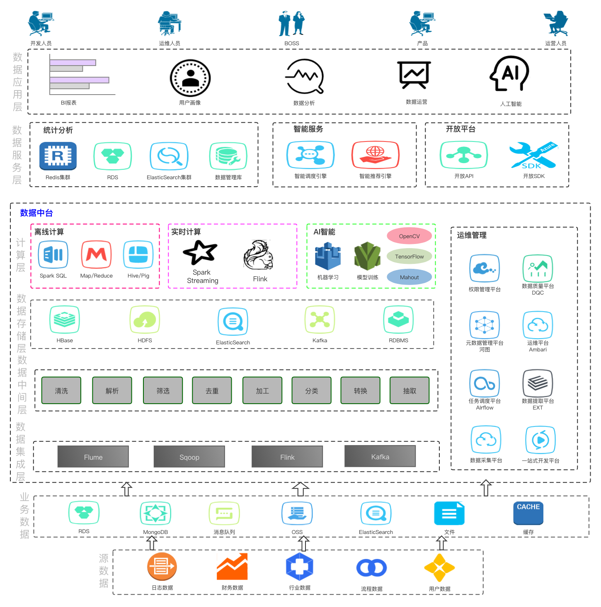
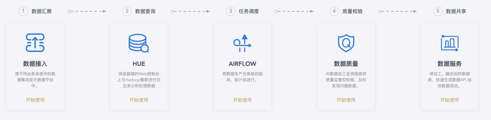

## 个人介绍
---
对大数据方向感兴趣的程序员，主要关注方向包括分布式计算存储、数据仓库、数据分析、数据中台工具、数据应用及产品等

## 读书经历

| 时间 | 学校 | 专业 |
| :---- | :---- | :---- |
| 2012.09至2015.06  | 中国科学院研究生院 | 计算机应用与技术|
| 2008.09至2012.06  | 哈尔滨工业大学 | 软件工程 |

## 工作经历

### 自如科技(2020.01 - 至今 )
1. 数据中台体系建设

2. 数据工具链建设(数据接入、数据发现、数据质量中心、数据服务化)

3. 数据产品(档案、画像、指标管理、埋点体系)

### 探探科技(2018.01 - 2020.01 )
1. 数据仓库建设
2. 数据工具链建设
3. 数据产品
4. 大数据平台搭建、运维

### 阿里巴巴(2015.06 - 2017.12 )
1. Java应用开发
2. 画像、圈人
3. 数据仓库ETL

## 个人评价

***结果导向***、***积极负责***、***团队管理***、***技术服务业务***

***Hive***、***Spark(Spark Streaming)***、***Kafka***、***Sqoop***

